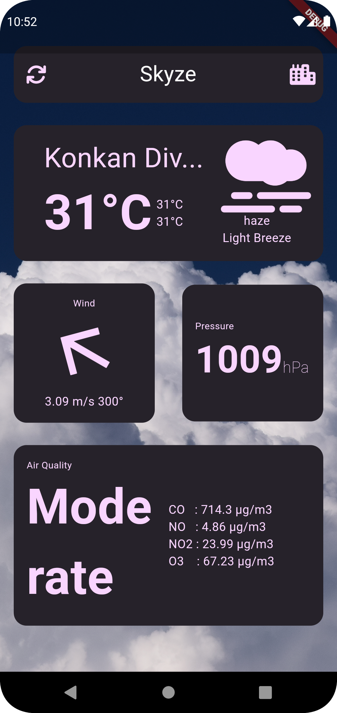
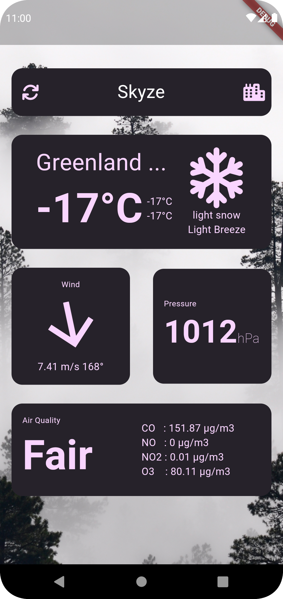

<h1 align = center > Skyze </h1>

Skyze is beautiful weather app made on flutter with openweathermap API
---
> **warning**
> Release app might not work as intented since it use free API key . 
> Recommmended to build it yourself using new api key

<!-- ### INDEX
[1 . Setting up environment ]() -->

### Setting up environment 

1 . Clone the repo 
```
git clone https://github.com/n1ved/skyze
```

2 . Create a file called ```credentials.dart``` inside ```lib/``` \
3 . Store your [API Key](https://openweathermap.org/api) inside ```credentials.dart``` in a variable called ```appID``` \
&emsp; like : \
&emsp; ``` String appID = "yourAPIkey" ``` \
4. run ```flutter pub get``` to get dependencies \
5. run ```flutter run``` to launch it on your emulator/device

---
### Screenshots
| Clear Sky                              | Smog                                     | Snow                                    |
|----------------------------------------|------------------------------------------|---------------------------------------- |
|  |  |  |


